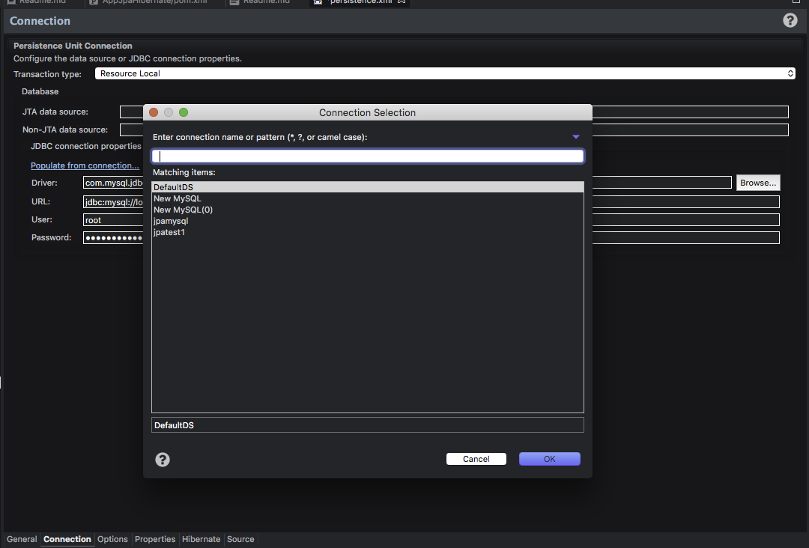

# JPA
## INTRODUCCION
### Evolucion de la Persistencia en java
* TopLink
* JDBC
* Enterprise Java Bean 1 y 2 : Entity Beans
* JDO
* Api de Persistencia
	+ Hibernate
	+ TopLink
* Enterprise Java Bean 3 : JPA
### Que es JPA (Java Persistence Api)?
Es una especificacion para la persistencia de objetos que provee las facilidadese Mapeo Relacional Objeto, para el manejo de datos relacionales en aplicaciones Java.

### Evolucion de JPA
1. JPA 1.0(2006)
   + Parte de EJB 3
   + Implementacion de referencia TopLinkEssentials
2. JPA 2 (2009)
	+ Parte de EJB 3.1
	+ Implementaciones
	  + Eclipselink
	  + Jboss Hibernate
	  + Open JPA
### Caracteristicas
 * Uso de POJOs (Plain Old Java Objects), entidadeades.
 * Utiliza Anotaciones y archivos XML
 * Soporte de caracteristias e OO: Herencia, Polimorfismo
 * Uso del lenguaje propio (JPQL) para definir consultas, estaticas o dinamicas de entidades.
 * Puede usarce en plataformas Java JSE y SE
 * El manejo de se puede hacer dentro de la aplicacion a delegarla al contenedor donde se va a adesplegar la aplicacion.
 * Soporte para implementaciones terceras.
 
## Arquitectura
### Entidad 
Objeto persistente del modelo del dominio de las caracteristicas de un POJO, que ha sido mapeada un tabla de BD aplicando ORM.
Cada instancia representa un registro en la tabla, por lo cual tiene lo siguiente:
	1. Un Objeto identificador unico
	2. Un conjunto de estados a traves de sus propiedades persistentes (getter y setter) o campos persistentes (variables de instancia).

El ORM se encarga de asociar metadata a las entidades lo cual se realiza con anotaciones y archivos XML.
### Entity Manager
Gestiona el ciclo de vida de las instacias de las entidadesy permite realizar operaciones con la BD. Persistir el estado de una entidad  o obtener datos de una Entidad.
Las entidades gestionadas por el entity manager son denominados `managed`

> Una instancia de Entity Manager  obtiene invocando el metodo `createEntityManager()` de un `EntityManagerFactory`.

#### Operaciones que permite realizar
* persist: Guarda un registro en la base de datos
* remove: Elimina un registro de la base de datos
* merge
* find 
* flush
* clear
* detach

### Entity Manager Factory
Fabrica utilizada para crear Entity Manager de entidades configuradas en un Percistence Unit.

#### Formas de obtener instancias del Entity Manager Factory
* Java SE: Uso de la clase persistence.
* Java EE: Inyeccion de dependencia con la anotacion @PersistentUnit

### Persistence Unit 
Define las configuracion y entidades que seran gestionadas por el Entity Manager. Se localiza en el archivo persistence.xml
La relacion entre el Persistence Unit y un Entity Manager Factory es de uno a uno.

### Persistence Context

* Contiene un conjunto de instancias e Entidades, por tanto esta asociado a un entity manager.
* Las entidades que salen del Persistence Context  se les denomina detached,
* No es visible a travez de la aplicacion pero se accede a travez del entity manager
* Tipo Scope
	a. Transaction-Scoped Persistence Context
	b. Extended-Scoped Persistence Context
	

# CICLO DE VIDA DE JPA


## CREAR UN PROYECTO JAVA CON JPA 
1. File >New> Other
2. Seleccionar Java > Java Project
3. Click Derecho en el Proyecto > Configure > Convert to maven project 
4. Bajar por maven las dependencias
	
````xml
<dependencies>
  	<dependency>
  		<groupId>antlr</groupId>
  		<artifactId>antlr</artifactId>
  		<version>2.7.7</version>
  	</dependency>
  	<dependency>
  		<groupId>dom4j</groupId>
  		<artifactId>dom4j</artifactId>
  		<version>1.6.1</version>
  	</dependency>
  	<dependency>
  		<groupId>org.hibernate.common</groupId>
  		<artifactId>hibernate-commons-annotations</artifactId>
  		<version>5.0.1.Final</version>
  	</dependency>
  	<dependency>
  		<groupId>org.hibernate</groupId>
  		<artifactId>hibernate-core</artifactId>
  		<version>5.2.12.Final</version>
  	</dependency>
  	<dependency>
  		<groupId>org.hibernate</groupId>
  		<artifactId>hibernate-entitymanager</artifactId>
  		<version>5.2.12.Final</version>
  	</dependency>
  	<dependency>
  		<groupId>org.hibernate.javax.persistence</groupId>
  		<artifactId>hibernate-jpa-2.1-api</artifactId>
  		<version>1.0.0.Final</version>
  	</dependency>
  <!-- https://mvnrepository.com/artifact/org.javassist/javassist -->
	<dependency>
	    <groupId>org.javassist</groupId>
	    <artifactId>javassist</artifactId>
	    <version>3.19.0-GA</version>
	</dependency>
  	<dependency>
  		<groupId>org.jboss.logging</groupId>
  		<artifactId>jboss-logging</artifactId>
  		<version>3.3.1.Final</version>
  	</dependency>
  	<dependency>
  		<groupId>org.jboss.spec.javax.transaction</groupId>
  		<artifactId>jboss-transaction-api_1.1_spec</artifactId>
  		<version>1.0.1.Final</version>
  	</dependency>
	<!-- https://mvnrepository.com/artifact/mysql/mysql-connector-java -->
	<dependency>
	    <groupId>mysql</groupId>
	    <artifactId>mysql-connector-java</artifactId>
	    <version>5.1.6</version>
	</dependency>

</dependencies>
````

5. Click Derecho en el Proyecto > Configure > Convert to JPA project > Next


6. Seleccionar Hibernate JPA y desabilitar la configuracion de la libreria/


7. Click derecho en el proyecto > Properties > Hibernate Settings > Details


8. En la seccion de Database Connection> Click en new > Seleccionar Driver > Especificar nombre y descripcion > Next
 

9. Especificar los campos requeridos > Hacer un Test Connection > Finish
 

10. Abrir el archivo persistence.xml > Pestania Connection > Seleccionar en Percistent Unit `Resource Local` >
 

11. Click en Populate from conection y seleccionar la conexion creada.
 

12. Seleccionar la pestania General del archivo `Persistence.xml` > En el campo Persistence Provider detallar  `org.hibernate.jpa.HibernatePersistenceProvider`
13. Crear las entidades que enlazaran a las tablas de la base de datos
14. En la seccion de Managed Classes, anadir la clase o paquete de las entidades.

